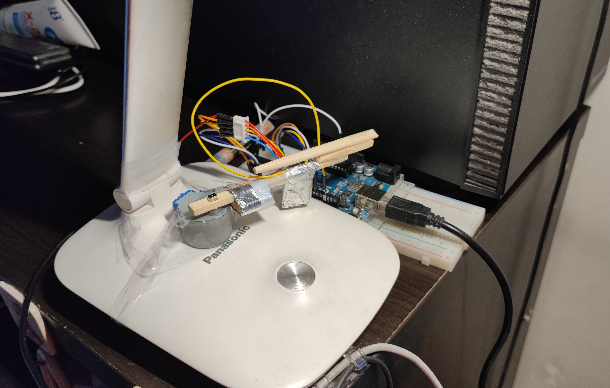
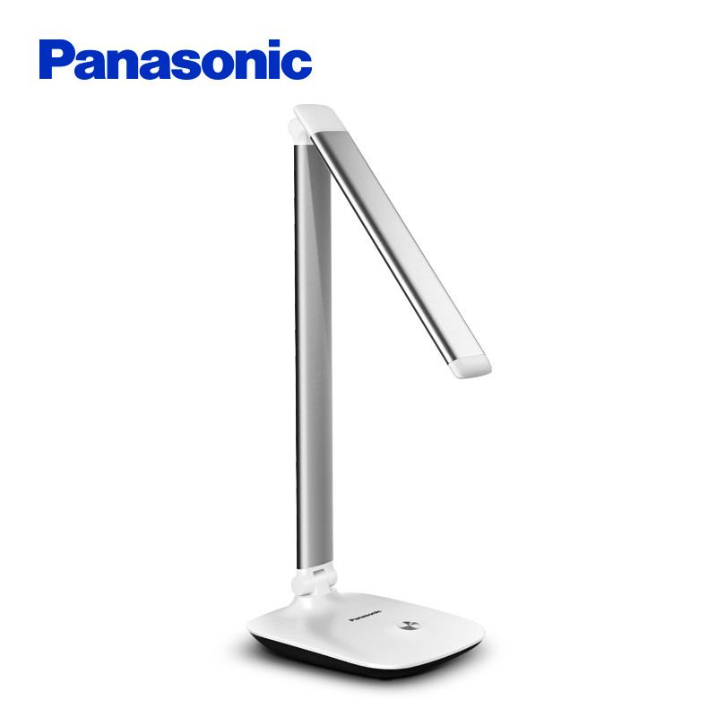
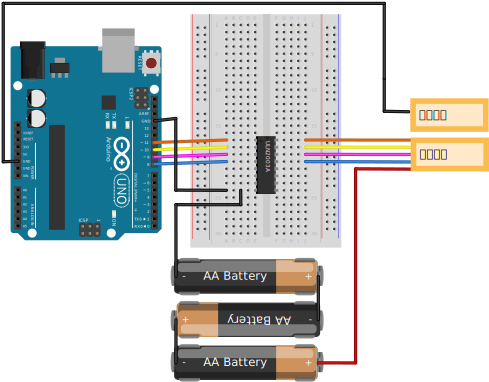
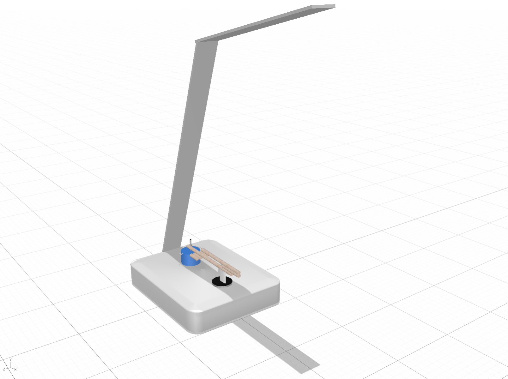
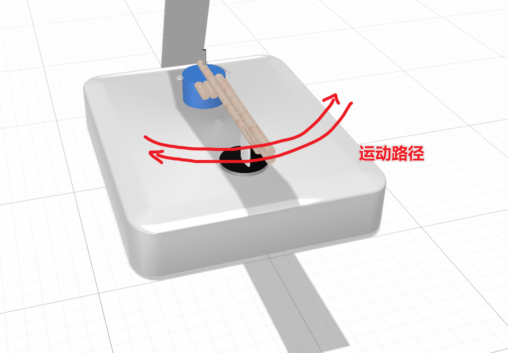
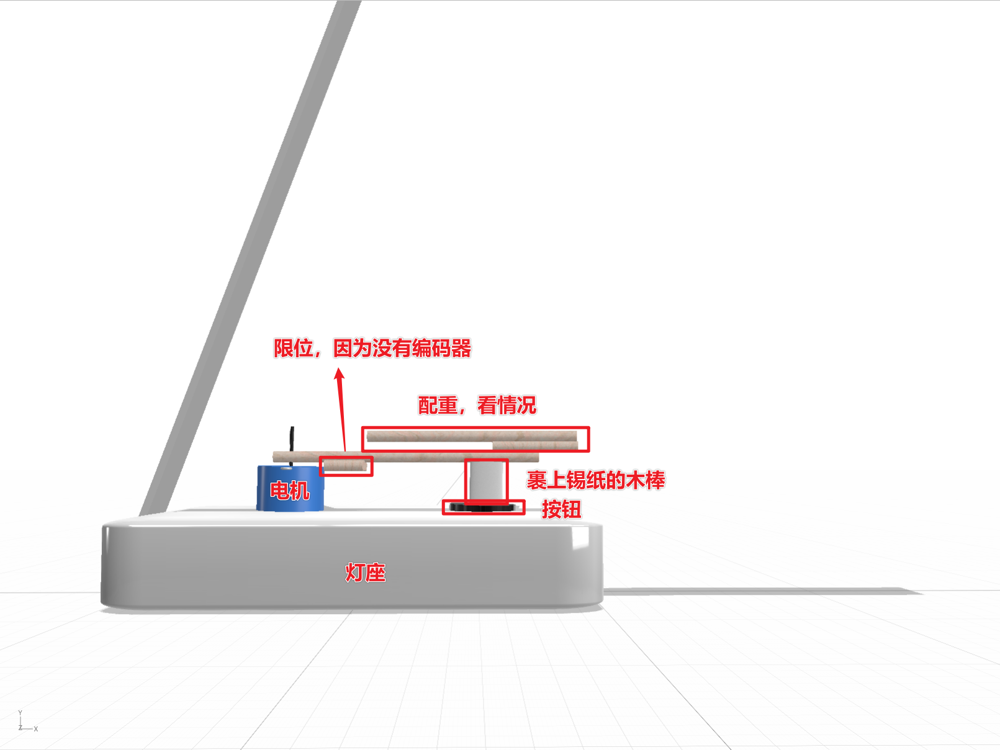
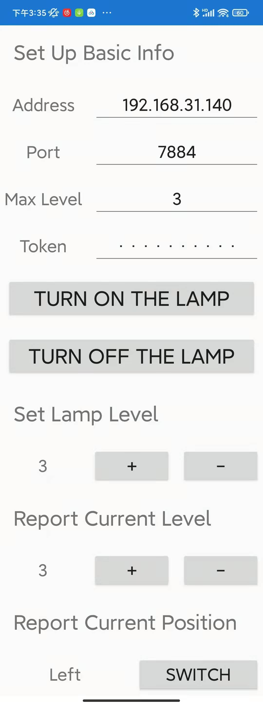
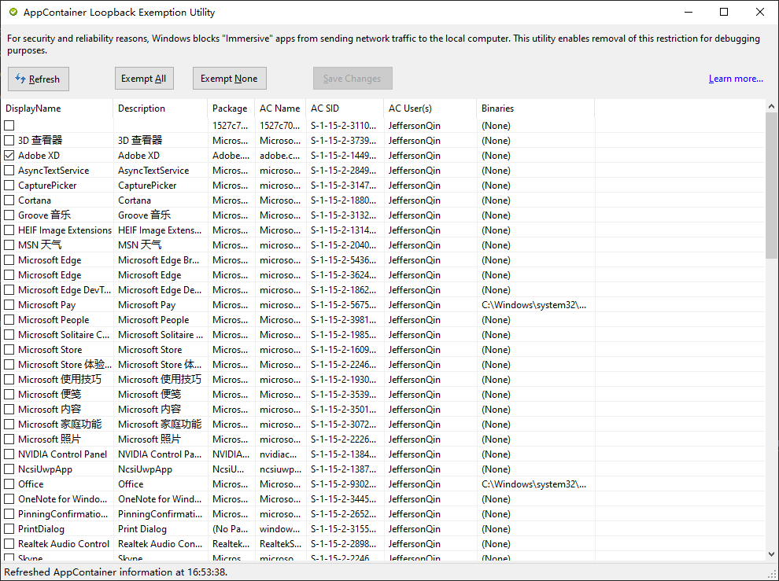

# Remote Lamp Switch 远程开灯

Panasonic 松下 HH-LT0608 台灯远程开关的解决方案。写这个的原因是想要躺床上开关书桌上的台灯（因为是黄光，床头灯是白光晚上眼睛难受）。

手上有闲置的 Arduino，所以花了一个下午实现一下。

电灯图 (图源苏宁)：

<div align="center">
	
</div>

## 文件结构

```
.
├─ arduino/lamp-controller # arduino 的代码
├─ diagram                 # 电路
├─ LampSwitch              # app 代码
├─ model                   # 场景模型
└─ server                  # 服务器代码
```

## 电路原理

猜测开关是有一个检测电容变化的电路，但也没办法验证（没有破拆）。经过实验，发现与人体绝缘的情况下把接地（有的时候不接地也行，很怪）的导体放在开关上会触发，所以这里用步进电机实现这个操作。

* 电机型号：28BYJ-48
* 驱动板：ULN2003APG
* Arduino Uno (Rev 3)

<div align="center">
	
</div>

电路文件 `diagram/motor.fzz` 可以用 fritzing 查看

## 机械结构

由于家里工具简陋，没有电钻，没有金属件，没有线锯，没有锉刀，所以设计得简单粗暴。但是没有关系，照样可以通过一些办法搞定（雾。

用到的工具：

* 美工刀
* 螺丝钉（用来打洞）
* 螺丝刀
* 一次性筷子
* 砂纸
* 各种胶带

原理示意图：

<div align="center">
	
</div>

<div align="center">
	
</div>

侧视图：

<div align="center">
	
</div>

注意的点：

* 由于没有编码器，所有就拿四根棍子（筷子剪的）做了限位，伤点就就伤吧，反正一天不会转几次（暴论）
* 我加了配重是因为转两次那根棍子就会往上翘...看情况吧，能动就行

模型文件在 `model/model.dn`。~~我不会建模，是随便找了个 adobe 全家桶里的东西画的。~~

<div align="center">
	
</div>

图为加工的轴的照片

## 通信原理

由于台灯在电脑旁边，所以我直接用串口进行通信。在电脑端建立 http server，数据通过发包获取。数据流向：

```
Arduino <==Serial==> PC / Http server <==> Mobile
```

注意事项：

* 需要统一波特率，默认为 9600 Hz

## Arduino

配置：

```c++
int loopcount = 48; # 用于调节电机每次转动的时间
```

## Server

配置：

```python
run_host = "0.0.0.0"      # server host
run_port = 7884           # server port
max_level = 3             # 灯调节的档数，直接开关为 1
current_level = 0         # 服务启动时处于的档数
current_position = 0      # 当前轴所在的位置（0为左，1为右）
api_token = "test-token"  # 用于验证请求的 token
serial_post = "COM5"      # 串口名称
baudrate = 9600           # 波特率
delay_time = 0.8          # 两次请求移动间隔时间
```

注意：串口通信用的库是 `pyserial`，不是 `serial`

## App

<div align="center">
	
</div>

用 Xamarin 开发，大部分代码抽取自我的项目 [YuzuMarker](https://github.com/JeffersonQin/YuzuMarker)

Nuget Dependency:

* Newtonsoft.Json

### Knwon Issues

* 设置的持久化还没写，static class 的 two-way binding 有点问题，bug 还没修

## UWP App Loopback

由于 UWP 对于本地回环网络的限制，所以如果控制服务器在本机则会产生问题。可以使用 Fiddler 之类的工具解除限制。关键词：UWP Loopback exemption


